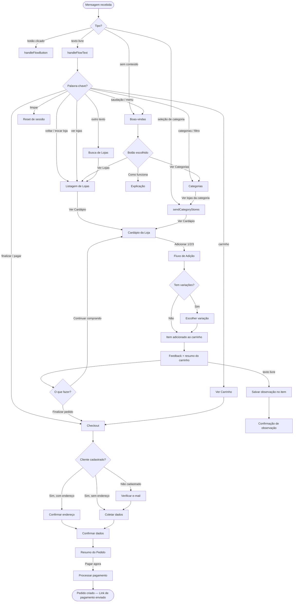

# Chatbot Zapediu — Fluxos de Conversa

> Sistema de _food delivery_ por WhatsApp. Todos os fluxos são gerenciados por `app/Services/Zapi/ZapiWebhookService.php`.

---

## Índice

1. [Roteamento de Mensagens](#1-roteamento-de-mensagens)
2. [Boas-vindas](#2-boas-vindas)
3. [Como Funciona](#3-como-funciona)
4. [Busca Livre de Lojas](#4-busca-livre-de-lojas)
5. [Listagem de Lojas](#5-listagem-de-lojas)
6. [Categorias](#6-categorias)
7. [Cardápio da Loja](#7-cardápio-da-loja)
8. [Adicionar ao Carrinho](#8-adicionar-ao-carrinho)
9. [Ver Carrinho](#9-ver-carrinho)
10. [Checkout](#10-checkout)
11. [Resumo do Pedido](#11-resumo-do-pedido)
12. [Pagamento](#12-pagamento)
13. [Estados do Pedido](#13-estados-do-pedido)
14. [Escape e Reset](#14-escape-e-reset)

---

## Diagrama Geral



---

## 1. Roteamento de Mensagens

Toda mensagem recebida é classificada antes de ser processada:

- **Botão clicado** — identifica o `buttonId` e executa a ação correspondente
- **Seleção de categoria** em carousel — exibe as lojas da categoria escolhida
- **Texto livre** — verifica se é uma palavra-chave ou envia para busca de lojas
- **Sem conteúdo reconhecível** — exibe as boas-vindas

### Palavras-chave reconhecidas

| Texto | Ação |
|-------|------|
| `oi`, `olá`, `menu`, `inicio`, `start` | Exibe boas-vindas |
| `limpar` | Reseta toda a sessão |
| `carrinho` | Exibe o carrinho atual |
| `finalizar`, `checkout`, `pagar` | Inicia o checkout |
| `voltar`, `trocar loja`, `outra loja` | Volta à listagem de lojas |
| `categorias`, `filtro`, `filtrar` | Exibe o carousel de categorias |
| `ver lojas`, `lojas` | Exibe a listagem de lojas |
| qualquer outro texto | Trata como busca de loja |

---

## 2. Boas-vindas

**Trigger:** saudação do cliente, primeira mensagem, ou nenhum conteúdo especial detectado.

O bot apresenta o serviço e oferece três opções de navegação:

| Opção | Próximo fluxo |
|-------|---------------|
| 🏪 Ver Lojas | Listagem de lojas |
| 🍔 Ver Categorias | Carousel de categorias |
| ❓ Como funciona | Explicação do serviço |

> **Atalho:** se o cliente digitar diretamente o que quer comer (ex: _"quero um hambúrguer"_), o bot ignora o menu de boas-vindas e já executa a busca de lojas relacionadas.

---

## 3. Como Funciona

**Trigger:** botão "❓ Como funciona".

O bot envia uma mensagem curta explicando o processo: escolher categoria → escolher loja → finalizar no WhatsApp.

---

## 4. Busca Livre de Lojas

**Trigger:** qualquer texto que não seja uma palavra-chave reconhecida.

O bot usa o texto como critério de busca (nome da loja, categoria, descrição).

**Alternativas:**

| Situação | Resultado |
|----------|-----------|
| Lojas encontradas | Exibe o carousel de lojas |
| Nenhuma loja encontrada | Informa que não encontrou e sugere usar o filtro de categorias |
| Poucos resultados | Completa automaticamente com lojas populares |

---

## 5. Listagem de Lojas

**Trigger:** botão "🏪 Ver Lojas", keywords `ver lojas` / `lojas`, ou resultado de busca.

Exibe um carousel com até 9 lojas por vez. Cada card mostra imagem, nome, categoria, avaliação, tempo estimado e taxa de entrega, com um botão para ver o cardápio.

**Alternativas:**

| Situação | Resultado |
|----------|-----------|
| Mais lojas disponíveis | Card "Ver mais" carrega a próxima página |
| Última página | Não exibe o card "Ver mais" |

---

## 6. Categorias

**Trigger:** botão "🍔 Ver Categorias" ou keywords `categorias` / `filtro`.

Exibe um carousel com as categorias ativas. Ao escolher uma categoria, o bot filtra e exibe somente as lojas daquela categoria, mantendo o mesmo padrão visual da listagem geral. Um card extra "Ver mais lojas" aparece ao final para voltar à listagem completa.

---

## 7. Cardápio da Loja

**Trigger:** botão "📖 Ver Cardápio" em qualquer carousel de lojas.

Exibe os produtos da loja em carousel, com até 5 produtos por página. Cada card mostra imagem, nome, preço, descrição resumida e um botão "➕ Adicionar".

**Alternativas:**

| Situação | Resultado |
|----------|-----------|
| Mais produtos | Card "Mostrar mais" carrega a próxima página |
| Última página | Não exibe "Mostrar mais" |
| Sempre | Card final "Voltar lojas" retorna à listagem |

---

## 8. Adicionar ao Carrinho

**Trigger:** botão "➕ Adicionar 1", "➕ Adicionar 2" ou "➕ Adicionar 3" no cardápio.

Cada card de produto exibe três botões de quantidade direta. O cliente escolhe quantas unidades quer sem nenhuma pergunta intermediária.

Fluxo simplificado: variação (se houver) → commit imediato.

---

### 8.0 Conflito de Loja

Se o carrinho já tem itens de **outra loja**, o bot alerta e pergunta o que o cliente deseja fazer:

| Opção | Resultado |
|-------|-----------|
| Manter carrinho atual | Cancela a adição e exibe o carrinho existente |
| Novo carrinho | Limpa o carrinho e reinicia a adição do novo produto |

---

### 8.1 Variação do Produto

> Etapa ignorada automaticamente se o produto não possui variações ativas.

O bot pergunta qual variação o cliente deseja (ex: tamanho, sabor, ponto da carne).

| Situação | Como é exibido |
|----------|----------------|
| Até 3 variações | Botões de resposta rápida |
| 4 ou mais variações | Lista interativa rolável |

---

### 8.2 Item Adicionado (Feedback)

Imediatamente após a adição, o bot confirma com um resumo completo do carrinho:

```
✅ 2x Batata Crocante 03 adicionado ao carrinho!

🛒 Seu carrinho:
• 2x Batata Crocante 03 — R$ 40,30
• 1x X-Burguer — R$ 25,90
💰 Total: R$ 66,20

💬 Se quiser adicionar uma observação ao último item, é só digitar!
Ex: sem cebola, sem molho, ponto bem passado…
```

| Opção | Resultado |
|-------|-----------|
| 🛍️ Continuar comprando | Volta ao cardápio da loja |
| ✅ Finalizar pedido | Inicia o checkout |
| Digitar texto livre | Salva como observação do último item adicionado |

> **Concorrência:** adições rápidas em sequência (ex: dois produtos antes do feedback chegar) são protegidas por lock de cache — ambos os itens são adicionados ao carrinho sem se sobrescreverem.

---

### 8.3 Observação (opcional, via texto livre)

Após ver o feedback de adição, enquanto o cliente não clicar em "Continuar" ou "Finalizar" nem digitar uma palavra-chave, qualquer texto livre digitado é salvo automaticamente como observação do último item.

O bot confirma: `📝 Observação salva: sem cebola | Para: Batata Crocante 03.`

A janela de observação fecha quando o cliente:
- Clica em "🛍️ Continuar comprando" ou "✅ Finalizar pedido"
- Digita qualquer palavra-chave de navegação (`carrinho`, `finalizar`, `voltar`, etc.)
- Digita um novo texto de observação (uma mensagem = uma observação final)

---

## 9. Ver Carrinho

**Trigger:** keyword `carrinho` ou botão de carrinho.

| Situação | Resultado |
|----------|-----------|
| Carrinho vazio | Informa que está vazio e orienta a escolher uma loja |
| Carrinho com itens | Lista itens com quantidade, variação, observação e total; exibe total geral e botão para finalizar |

---

## 10. Checkout

**Trigger:** botão "Finalizar pedido" no carrinho, ou keywords `finalizar` / `checkout` / `pagar`.

O bot verifica se o telefone já está cadastrado e segue um dos três caminhos:

---

### Caminho A — Cliente recorrente com endereço salvo

O bot recupera o nome e o último endereço e exibe uma confirmação.

| Opção | Resultado |
|-------|-----------|
| Confirmar endereço | Segue para a confirmação dos dados |
| Alterar endereço | Solicita novo endereço por texto e depois segue para a confirmação |

---

### Caminho B — Cliente recorrente sem endereço

O cliente já tem cadastro mas nunca informou endereço. O bot coleta apenas o endereço e a referência, depois segue para a confirmação dos dados.

---

### Caminho C — Cliente novo

O telefone não está cadastrado. O bot solicita o e-mail e segue conforme o resultado:

| Situação | Resultado |
|----------|-----------|
| E-mail inválido | Bot pede para digitar novamente |
| E-mail novo | Cria conta minimal e coleta dados (nome → endereço → referência) |
| E-mail já cadastrado | Envia código de 6 dígitos ao e-mail (válido por 10 min) e aguarda confirmação no WhatsApp |
| Código correto | Vincula o número ao cadastro e coleta dados faltantes |
| Código errado | Permite tentar novamente |
| Código expirado | Solicita o e-mail novamente |

---

### Coleta de dados

Quando dados estão faltando, o bot coleta em sequência:

1. **Nome completo**
2. **Endereço** (logradouro, número, bairro, cidade, UF)
3. **Referência** — opcional; o cliente pode pular
4. **E-mail** — opcional; o cliente pode pular

Ao final, o bot exibe todos os dados coletados e permite corrigir qualquer campo digitando `campo: novo valor` (ex: `endereco: Av. Paulista, 1000`).

---

## 11. Resumo do Pedido

**Trigger:** confirmação dos dados pelo cliente.

O bot exibe um resumo com itens, subtotal, taxa de entrega, total, endereço e tempo estimado.

**Alternativas:**

| Situação | Resultado |
|----------|-----------|
| Pagar agora | Processa o pagamento |
| Edição inline | Cliente digita `campo: valor` e o bot reenvia o resumo atualizado |

Campos editáveis: `nome`, `endereco`, `referencia`, `email`.

---

## 12. Pagamento

**Trigger:** botão "💳 Pagar agora".

O bot cria o pedido no banco de dados, gera um código de rastreio legível (`ZAP-AAMMDD-XXXX`), cria os itens do pedido e envia um link de pagamento que aceita PIX e cartão.

Após o envio, o carrinho é limpo da sessão e os dados do último pedido (código, link, valor) são preservados para referência.

---

## 13. Estados do Pedido

**Arquivo:** `app/Domain/Orders/OrderStateMachine.php`

O pedido avança linearmente e pode ser cancelado a qualquer momento antes de ser entregue:

```
new → confirmed → preparing → out_for_delivery → delivered
```

| Estado | Descrição |
|--------|-----------|
| `new` | Pedido criado, aguardando a loja confirmar |
| `confirmed` | Loja aceitou o pedido |
| `preparing` | Pedido em preparo na cozinha |
| `out_for_delivery` | Entregador a caminho |
| `delivered` | Entregue — estado final, não pode ser cancelado |
| `cancelled` | Cancelado — permitido em qualquer estado, exceto `delivered` |

---

## 14. Escape e Reset

### Escape do checkout

Em qualquer etapa do checkout, o cliente pode digitar `cancelar`, `voltar`, `menu` ou `inicio` para abandonar o processo. O bot limpa a etapa atual e retorna às boas-vindas.

### Reset completo

Digitando `limpar`, toda a sessão é apagada — carrinho, dados do cliente, etapa do checkout e resultados de busca. O bot confirma o reset e orienta o cliente a recomeçar.
