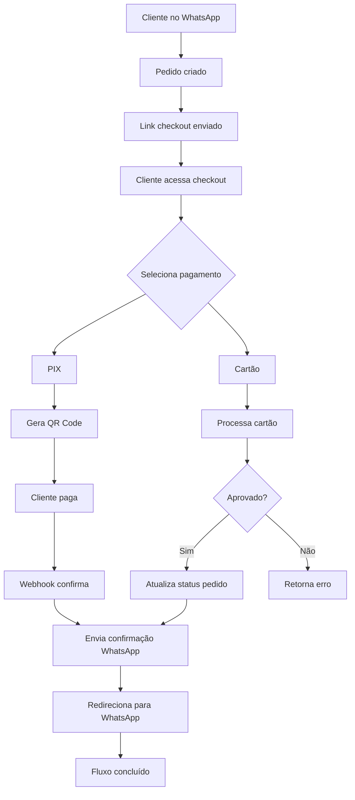

# Plano de Implementação: Checkout Completo Funcional

## Análise do Estado Atual

Após análise detalhada do código, identifiquei os seguintes problemas no fluxo de checkout:

### 1. Configuração do Link Estático
- **Problema**: O `ZAPI_PAYMENT_BASE_URL` no `.env` está como `https://localhost:5173/checkout`, mas o endpoint real do backend é `http://localhost:8080/public/orders/{code}/checkout`
- **Localização**: `config/services.php` linha 81 e `.env` linha 47
- **Impacto**: O link gerado no WhatsApp não corresponde ao endpoint correto

### 2. Endpoint PublicCheckoutController Incompleto
- **Problema**: A resposta do endpoint `/public/orders/{code}/checkout` não inclui:
  - Imagens dos produtos
  - Endereço completo do cliente
  - Número do WhatsApp do cliente
- **Localização**: `app/Http/Controllers/Api/PublicCheckoutController.php`
- **Impacto**: Frontend não tem informações completas para exibir no checkout

### 3. Inconsistência na Busca de Carteira (Wallet)
- **Problema**: No método `createPix` usa `$order->store_id` e no `createCardPayment` usa `$order->company_id`
- **Localização**: `app/Http/Controllers/Api/MercadoPagoController.php` linhas 66 e 181
- **Impacto**: Pode causar falha na geração de PIX se `store_id` ≠ `company_id`

### 4. Status do Pedido Não Atualizado
- **Problema**: No pagamento com cartão, quando aprovado, o status do pedido não é atualizado (linha 232 comentada)
- **Localização**: `app/Http/Controllers/Api/MercadoPagoController.php` linha 232
- **Impacto**: Sistema não registra que o pagamento foi concluído

### 5. Falta de Redirecionamento para WhatsApp
- **Problema**: Após pagamento bem-sucedido, não há mecanismo para redirecionar o cliente de volta ao WhatsApp
- **Impacto**: Cliente fica "preso" na página de pagamento sem saber o próximo passo

### 6. Falta de Mensagem de Confirmação
- **Problema**: Não há envio automático de mensagem WhatsApp confirmando o pedido
- **Impacto**: Cliente não recebe confirmação de que o pedido está sendo preparado

## Soluções Propostas

### 1. Correção do Link Estático
```php
// Em config/services.php linha 81, alterar para:
'payment_base_url' => env('ZAPI_PAYMENT_BASE_URL', 'http://localhost:8080/public/orders'),

// No .env, configurar:
ZAPI_PAYMENT_BASE_URL=http://localhost:8080/public/orders
```

### 2. Melhoria do PublicCheckoutController

#### 2.1 Adicionar Imagens dos Produtos
```php
private function serializeItems(Order $order): array
{
    $items = data_get($order->raw_payload, 'cart.items', data_get($order->raw_payload, 'order.items', []));

    if (! is_array($items)) {
        return [];
    }

    return collect($items)->map(function (array $item): array {
        $quantity = max(1, (int) ($item['quantity'] ?? 1));
        $basePrice = (float) ($item['base_price'] ?? data_get($item, 'unit_price', data_get($item, 'price', 0)));
        $additionalPrice = (float) ($item['additional_price'] ?? 0);

        return [
            'product_id' => isset($item['product_id']) ? (int) $item['product_id'] : null,
            'name' => (string) ($item['product_name'] ?? data_get($item, 'name', 'Produto')),
            'variation_name' => data_get($item, 'variation_name'),
            'quantity' => $quantity,
            'unit_price' => round($basePrice + $additionalPrice, 2),
            'line_total' => round(($basePrice + $additionalPrice) * $quantity, 2),
            'observation' => data_get($item, 'observation'),
            'image_url' => data_get($item, 'image_url'), // NOVO CAMPO
        ];
    })->values()->all();
}
```

#### 2.2 Adicionar Endereço e WhatsApp do Cliente
```php
// No método show(), adicionar ao array 'customer':
'customer' => [
    'name' => $order->user?->name,
    'email' => $order->user?->email,
    'number' => $order->user?->phone_number,
    'whatsapp' => $order->user?->primaryPhone?->phone, // NOVO
    'address' => $this->getCustomerAddress($order->user), // NOVO
],
```

#### 2.3 Método para Obter Endereço
```php
private function getCustomerAddress(?User $user): ?array
{
    if (!$user) {
        return null;
    }
    
    $address = $user->addresses()->where('is_primary', true)->first();
    
    if (!$address) {
        return null;
    }
    
    return [
        'street' => $address->street,
        'number' => $address->number,
        'district' => $address->district,
        'city' => $address->city,
        'state' => $address->state,
        'zip_code' => $address->zip_code,
        'formatted' => $address->formatted,
        'notes' => $address->notes,
    ];
}
```

### 3. Correção da Inconsistência na Busca de Carteira
```php
// Em ambos os métodos createPix() e createCardPayment(), usar:
$wallet = Wallet::where('company_id', $order->company_id)->first();

// Adicionar fallback para store_id se company_id não existir:
if (!$wallet) {
    $wallet = Wallet::where('company_id', $order->store_id)->first();
}
```

### 4. Atualização do Status do Pedido
```php
// No método createCardPayment(), após pagamento aprovado:
if ($payment->status === 'approved') {
    $order->update([
        'payment_status' => 'paid',
        'mp_payment_id' => $payment->id,
        'mp_payment_status' => 'approved',
        'mp_payment_approved_at' => now(),
    ]);
    
    // Disparar job para enviar notificação WhatsApp
    SendStatusNotificationJob::dispatch(
        $order->company_id,
        $order->user->primaryPhone?->phone ?? $order->user->phone,
        'order_confirmed',
        ['order_code' => $order->code]
    );
    
    return response()->json([
        'status' => 'approved',
        'message' => 'Pagamento aprovado com sucesso!',
        'payment_id' => $payment->id,
        'redirect_url' => $this->buildWhatsAppRedirectUrl($order), // NOVO
    ]);
}
```

### 5. Implementação do Redirecionamento para WhatsApp
```php
private function buildWhatsAppRedirectUrl(Order $order): string
{
    $phone = $order->user->primaryPhone?->phone ?? $order->user->phone;
    $message = urlencode("Pedido #{$order->code} confirmado! Está sendo preparado. Qualquer dúvida pode falar aqui no chat.");
    
    return "https://wa.me/{$phone}?text={$message}";
}

// Adicionar também no retorno do PIX quando o pagamento for confirmado via webhook
```

### 6. Envio de Mensagem de Confirmação
```php
// Criar job específico para confirmação de pedido
class SendOrderConfirmationJob implements ShouldQueue
{
    public function __construct(
        private readonly Order $order
    ) {}
    
    public function handle(WhatsAppOrchestrator $orchestrator): void
    {
        $phone = $this->order->user->primaryPhone?->phone ?? $this->order->user->phone;
        $message = "✅ Pedido #{$this->order->code} confirmado!\n\n";
        $message .= "Seu pedido está sendo preparado e em breve será entregue.\n";
        $message .= "Qualquer dúvida pode falar aqui no chat.\n\n";
        $message .= "Código para o entregador: {$this->order->code_confirm}";
        
        $orchestrator->sendMessage($this->order->company_id, $phone, $message);
    }
}

// Disparar após confirmação de pagamento
SendOrderConfirmationJob::dispatch($order);
```

## Contratos de API (HTTP Request/Response)

### 1. GET /public/orders/{code}/checkout
**Request**: `GET http://localhost:8080/public/orders/ZAP-260505-IGPP/checkout?token=DUKUq6qymWSHsw6fZPDLoYiIhLoO5MpB`

**Response (200 OK)**:
```json
{
  "order": {
    "code": "ZAP-260505-IGPP",
    "status": "pending",
    "payment_status": "pending",
    "payment_method": null,
    "subtotal": 45.90,
    "delivery_fee": 8.00,
    "discount": 0.00,
    "total": 53.90,
    "notes": "Sem cebola",
    "ordered_at": "2026-05-05T21:30:00Z",
    "items": [
      {
        "product_id": 123,
        "name": "Hambúrguer Artesanal",
        "variation_name": "Com bacon",
        "quantity": 2,
        "unit_price": 22.95,
        "line_total": 45.90,
        "observation": "Bem passado",
        "image_url": "https://pub-b685ab7948c34d1097563860d887d004.r2.dev/products/hamburguer.jpg"
      }
    ]
  },
  "store": {
    "logo": "https://.../logo.jpg",
    "name": "Burger House",
    "slug": "burger-house"
  },
  "customer": {
    "name": "João Silva",
    "email": "joao@email.com",
    "number": "+5511999999999",
    "whatsapp": "+5511999999999",
    "address": {
      "street": "Rua das Flores",
      "number": "123",
      "district": "Centro",
      "city": "São Paulo",
      "state": "SP",
      "zip_code": "01234-567",
      "formatted": "Rua das Flores, 123 - Centro, São Paulo - SP",
      "notes": "Apartment 45"
    }
  },
  "checkout": {
    "can_pay": true,
    "source": "whatsapp",
    "delivery_mode": "delivery"
  },
  "payment_methods": ["pix", "card"]
}
```

### 2. POST /public/checkout/pix
**Request**:
```json
{
  "code": "ZAP-260505-IGPP",
  "token": "DUKUq6qymWSHsw6fZPDLoYiIhLoO5MpB",
  "cpf": "123.456.789-09"
}
```

**Response (200 OK)**:
```json
{
  "qr_code_base64": "data:image/png;base64,iVBORw0KGgoAAAANSUhEUg...",
  "qr_code": "00020101021226870014br.gov.bcb.pix2561...",
  "payment_id": "1234567890",
  "expiration_date": "2026-05-06T01:30:00Z"
}
```

### 3. POST /public/checkout/card
**Request**:
```json
{
  "code": "ZAP-260505-IGPP",
  "token": "DUKUq6qymWSHsw6fZPDLoYiIhLoO5MpB",
  "card_token": "token_gerado_pelo_mp_js",
  "installments": 1,
  "payment_method_id": "visa",
  "issuer_id": "123",
  "cpf": "123.456.789-09",
  "email": "joao@email.com"
}
```

**Response (200 OK - Aprovado)**:
```json
{
  "status": "approved",
  "message": "Pagamento aprovado com sucesso!",
  "payment_id": "1234567890",
  "redirect_url": "https://wa.me/5511999999999?text=Pedido%20%23ZAP-260505-IGPP%20confirmado!%20Está%20sendo%20preparado."
}
```

**Response (200 OK - Em análise)**:
```json
{
  "status": "in_process",
  "message": "Pagamento em análise.",
  "payment_id": "1234567890"
}
```

**Response (400 - Recusado)**:
```json
{
  "status": "rejected",
  "error": "Pagamento recusado.",
  "detail": "cc_rejected_insufficient_amount"
}
```

## Testes Automatizados

### 1. Testes do PublicCheckoutController
```php
class PublicCheckoutControllerTest extends TestCase
{
    public function test_checkout_endpoint_returns_complete_data()
    {
        // Arrange
        $order = Order::factory()->create();
        $token = Str::random(32);
        $order->raw_payload = ['checkout' => ['public_token' => $token]];
        $order->save();
        
        // Act
        $response = $this->get("/public/orders/{$order->code}/checkout?token={$token}");
        
        // Assert
        $response->assertStatus(200);
        $response->assertJsonStructure([
            'order' => [
                'code', 'status', 'payment_status', 'total', 'items' => [
                    '*' => ['product_id', 'name', 'quantity', 'unit_price', 'line_total', 'image_url']
                ]
            ],
            'customer' => ['name', 'email', 'number', 'whatsapp', 'address'],
            'store' => ['logo', 'name', 'slug'],
            'checkout' => ['can_pay', 'source', 'delivery_mode'],
            'payment_methods'
        ]);
    }
}
```

### 2. Testes do MercadoPagoController
```php
class MercadoPagoControllerTest extends TestCase
{
    public function test_pix_payment_generates_qr_code()
    {
        // Arrange
        $order = Order::factory()->create(['total' => 50.00]);
        $token = Str::random(32);
        $order->raw_payload = ['checkout' => ['public_token' => $token]];
        $order->save();
        
        // Mock MercadoPago SDK
        $this->mock(PaymentClient::class, function ($mock) {
            $mock->shouldReceive('create')->andReturn((object) [
                'id' => '123',
                'status' => 'pending',
                'point_of_interaction' => (object) [
                    'transaction_data' => (object) [
                        'qr_code_base64' => 'base64_fake',
                        'qr_code' => 'pix_code_fake'
                    ]
                ]
            ]);
        });
        
        // Act
        $response = $this->postJson('/public/checkout/pix', [
            'code' => $order->code,
            'token' => $token,
            'cpf' => '12345678909'
        ]);
        
        // Assert
        $response->assertStatus(200);
        $response->assertJsonStructure([
            'qr_code_base64', 'qr_code', 'payment_id'
        ]);
    }
    
    public function test_card_payment_updates_order_status()
    {
        // Arrange
        $order = Order::factory()->create(['total' => 50.00]);
        $token = Str::random(32);
        $order->raw_payload = ['checkout' => ['public_token' => $token]];
        $order->save();
        
        // Mock MercadoPago SDK para retornar approved
        $this->mock(PaymentClient::class, function ($mock) {
            $mock->shouldReceive('create')->andReturn((object) [
                'id' => '123',
                'status' => 'approved'
            ]);
        });
        
        // Act
        $response = $this->postJson('/public/checkout/card', [
            'code' => $order->code,
            'token' => $token,
            'card_token' => 'fake_token',
            'installments' => 1,
            'payment_method_id' => 'visa',
            'cpf' => '12345678909',
            'email' => 'test@email.com'
        ]);
        
        // Assert
        $response->assertStatus(200);
        $response->assertJson(['status' => 'approved']);
        
        // Verificar se order foi atualizada
        $this->assertDatabaseHas('orders', [
            'id' => $order->id,
            'payment_status' => 'paid',
            'mp_payment_id' => '123'
        ]);
    }
}
```

### 3. Testes de Integração Completa
```php
class CheckoutFlowIntegrationTest extends TestCase
{
    public function test_complete_checkout_flow_from_whatsapp_to_confirmation()
    {
        // 1. Simular criação de pedido via WhatsApp
        // 2. Acessar checkout público
        // 3. Realizar pagamento PIX
        // 4. Simular webhook de confirmação
        // 5. Verificar envio de mensagem WhatsApp
        // 6. Verificar redirecionamento
    }
}
```

## Diagrama de Fluxo



## Próximos Passos

1. **Prioridade 1**: Correções críticas
   - Corrigir inconsistência na busca de carteira
   - Atualizar status do pedido no pagamento com cartão
   - Corrigir configuração do link estático

2. **Prioridade 2**: Melhorias no checkout
   - Adicionar imagens dos produtos
   - Adicionar endereço e WhatsApp do cliente
   - Implementar redirecionamento para WhatsApp

3. **Prioridade 3**: Notificações
   - Implementar envio de mensagem de confirmação
   - Criar jobs para notificações assíncronas

4. **Prioridade 4**: Testes
   - Criar testes unitários
   - Criar testes de integração
   - Testar fluxo completo

## Observações Finais

- Todas as alterações devem incluir comentários em português explicando a funcionalidade
- Manter compatibilidade com versões anteriores
- Considerar multi-tenancy (cada loja com sua carteira Mercado Pago)
- Logs detalhados para debugging em produção
- Tratamento adequado de erros e exceções