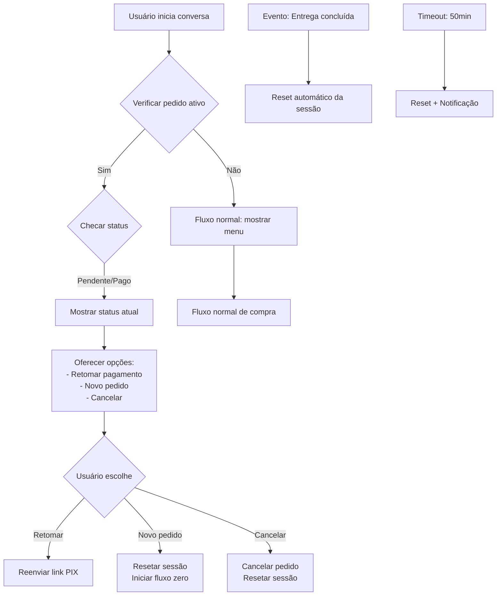

# Plano de Implementação: Persistência de Dados no Root Code

## Problema Identificado
O erro "Carrinho Vazio" ocorre quando o usuário clica em "Pagar Agora" após já ter gerado um pedido pendente. A sessão é limpa no clique, perdendo a referência do pedido ativo.

## Análise do Fluxo Atual

### Estado Atual do Sistema
1. **Armazenamento de Estado**: Usa cache Redis com prefixo `zapi:flow:state:{telefone}` (FlowManager)
2. **Ciclo de Vida do Pedido**:
   - `processPayment()`: Cria pedido, gera link de pagamento, limpa carrinho mas salva referência
   - Estado salvo: `last_order_code`, `last_order_id`, `last_payment_link`
   - Carrinho: `['store_id' => $storeId, 'items' => []]` (ESVAZIADO)
3. **Re-entrada**: Quando usuário clica "Pagar Agora" novamente, verifica carrinho vazio → erro

### Arquivos Principais
- `app/Services/Zapi/Flows/CheckoutFlow.php` - Processamento de pagamento
- `app/Services/Zapi/Flows/FlowManager.php` - Gerenciamento de estado
- `app/Services/Zapi/Flows/GreetingFlow.php` - Fluxo inicial
- `app/Services/Zapi/Handlers/ButtonHandler.php` - Tratamento de botões
- `app/Services/Zapi/Handlers/TextHandler.php` - Tratamento de texto

## Solução Proposta

### 1. Ponto de Persistência (Geração de Checkout)
**Problema**: Carrinho é esvaziado após gerar pedido, mas referência é mantida.

**Solução**: Manter estrutura do carrinho para reutilização, adicionar flag de pedido ativo.

```php
// Em CheckoutFlow::processPayment(), após criar pedido:
$state['active_order'] = [
    'order_id' => $order->id,
    'order_code' => $orderCode,
    'status' => 'pending',
    'payment_status' => 'pending',
    'payment_link' => $paymentLink,
    'created_at' => now()->toIso8601String(),
    'cart_snapshot' => $cart // Preservar snapshot do carrinho
];
// NÃO limpar carrinho completamente
$state['cart'] = ['store_id' => $storeId, 'items' => []]; // Mantém store_id
$this->saveFlowState($phone, $state);
```

### 2. Ponto de Re-entrada (Proteção de Sessão)
**Problema**: Não há verificação de pedidos ativos no início do fluxo.

**Solução**: Adicionar middleware de verificação em pontos estratégicos:

#### 2.1. Novo Método: `checkActiveOrderRedirect()`
```php
private function checkActiveOrderRedirect(string $phone): bool
{
    $state = $this->flow->getState($phone);
    
    if (empty($state['active_order'])) {
        return false; // Sem pedido ativo, fluxo normal
    }
    
    $orderData = $state['active_order'];
    $order = Order::find($orderData['order_id']);
    
    if (!$order) {
        // Pedido não existe mais, limpar estado
        unset($state['active_order']);
        $this->saveFlowState($phone, $state);
        return false;
    }
    
    // Verificar status e redirecionar
    if ($order->status === 'pending' && $order->payment_status !== 'paid') {
        // Pedido pendente de pagamento
        return $this->sendPendingOrderMessage($phone, $order, $orderData['payment_link']);
    } elseif ($order->status === 'pending' && $order->payment_status === 'paid') {
        // Pedido pago, em preparação
        return $this->sendPaidOrderMessage($phone, $order);
    } elseif (in_array($order->status, ['preparing', 'delivering'])) {
        // Pedido em andamento
        return $this->sendInProgressOrderMessage($phone, $order);
    }
    
    return false;
}
```

#### 2.2. Pontos de Inserção:
1. **GreetingFlow::sendWelcomePrompt()** - Antes de mostrar menu
2. **TextHandler::handle()** - No início do tratamento de texto
3. **ButtonHandler::handleFlowButton()** - Para botões genéricos

### 3. Regras de Reset (Limpeza de Variáveis)
**Regra**: Sessão só pode ser resetada em dois cenários:

#### 3.1. Sucesso Logístico (ENTREGUE)
**Local**: `app/Services/Whatsapp/FinishDeliveryHandler.php`
```php
// Após validar código e marcar como delivered:
$order->status = 'delivered';
$order->save();

// Resetar sessão do cliente
$customerPhone = $order->user->phone; // Ou extrair do pedido
$this->flow->resetState($customerPhone);

// Opcional: enviar mensagem de agradecimento
$zapi->sendText($customerPhone, "🎉 *Pedido ENTREGUE!* Obrigado por escolher Zapediu! 🛵💨");
```

#### 3.2. Abandono (Time-out de 50 minutos)
**Implementar Job agendado**:
```php
// app/Console/Commands/CleanupPendingOrders.php
public function handle()
{
    $expiredOrders = Order::where('status', 'pending')
        ->where('payment_status', '!=', 'paid')
        ->where('created_at', '<', now()->subMinutes(50))
        ->get();
    
    foreach ($expiredOrders as $order) {
        // Resetar sessão
        $customerPhone = $order->user->phone;
        $this->flow->resetState($customerPhone);
        
        // Notificar usuário
        $this->zapiClient->sendText(
            $customerPhone,
            "⏰ *Link de pagamento expirado*\n\nSeu pedido #{$order->code} expirou após 50 minutos sem pagamento.\n\nDigite *oi* para fazer um novo pedido!"
        );
        
        // Opcional: cancelar pedido no sistema
        $order->update(['status' => 'cancelled', 'rejection_reason' => 'timeout']);
    }
}
```

### 4. Opção de "Novo Pedido"
**Quando oferecer**: Sempre que houver pedido pendente (não pago)

#### 4.1. Botão em Mensagens de Pedido Pendente
```php
private function sendPendingOrderMessage(string $phone, Order $order, string $paymentLink): bool
{
    $message = "📋 *Você tem um pedido pendente!*\n\n";
    $message .= "🧾 Pedido: #{$order->code}\n";
    $message .= "💰 Valor: R$ " . number_format($order->total, 2, ',', '.') . "\n";
    $message .= "⏰ Criado: " . $order->created_at->format('d/m H:i') . "\n\n";
    $message .= "Deseja finalizar este pedido ou fazer um novo?";
    
    $buttons = [
        ['id' => 'order_resume_' . $order->id, 'label' => '🔗 Retomar Pagamento'],
        ['id' => 'order_new_' . $order->id, 'label' => '🛒 Fazer Novo Pedido'],
        ['id' => 'order_cancel_' . $order->id, 'label' => '❌ Cancelar Pedido'],
    ];
    
    return $this->zapiClient->sendButtonActions($phone, $message, $buttons);
}
```

#### 4.2. Tratamento do Botão "Fazer Novo Pedido"
```php
// Em ButtonHandler::handleFlowButton()
if (str_starts_with($buttonId, 'order_new_')) {
    $orderId = (int) str_replace('order_new_', '', $buttonId);
    
    // Limpar estado atual (incluindo active_order)
    $this->flow->resetState($phone);
    
    // Opcional: marcar pedido anterior como abandonado
    $order = Order::find($orderId);
    if ($order && $order->status === 'pending') {
        $order->update(['status' => 'cancelled', 'rejection_reason' => 'abandoned']);
    }
    
    // Iniciar fluxo do zero
    return $this->greetingFlow->sendWelcomePrompt($phone);
}
```

## Diagrama de Fluxo



## Arquivos a Modificar

### 1. `app/Services/Zapi/Flows/CheckoutFlow.php`
- Modificar `processPayment()` para salvar `active_order`
- Adicionar métodos `checkActiveOrderRedirect()`, `sendPendingOrderMessage()`, etc.
- Adicionar lógica de reenvio de link para pedidos pendentes

### 2. `app/Services/Zapi/Flows/FlowManager.php`
- Adicionar método `getActiveOrder()` para consulta centralizada
- Adicionar método `clearActiveOrder()` para limpeza seletiva

### 3. `app/Services/Zapi/Flows/GreetingFlow.php`
- Adicionar verificação no `sendWelcomePrompt()`
- Modificar `handleFirstMessage()` para redirecionar se houver pedido ativo

### 4. `app/Services/Zapi/Handlers/ButtonHandler.php`
- Adicionar casos para `order_new_{id}`, `order_resume_{id}`, `order_cancel_{id}`
- Integrar com `checkActiveOrderRedirect()`

### 5. `app/Services/Zapi/Handlers/TextHandler.php`
- Adicionar verificação no início do `handle()`

### 6. `app/Services/Whatsapp/FinishDeliveryHandler.php`
- Adicionar reset de sessão ao finalizar entrega

### 7. Novo Comando: `app/Console/Commands/CleanupPendingOrders.php`
- Implementar limpeza de pedidos abandonados

### 8. Agendamento no `app/Console/Kernel.php`
```php
$schedule->command('orders:cleanup-pending')->everyFifteenMinutes();
```

## Tom de Voz e Identidade Zapediu

Todas as mensagens devem seguir a identidade:
- **Ágil**: Emojis, frases curtas
- **Focada em delivery**: 🛵💨, 🍔, 🎉
- **Clara**: Informações essenciais, sem ruído
- **Empática**: Entender necessidades do cliente

Exemplos:
- "🎉 *Pedido ENTREGUE!* Obrigado por escolher Zapediu! 🛵💨"
- "⏰ *Link expirado* - Seu pedido #ZAP-260505-ABCD ficou mais de 50min esperando..."
- "📋 *Você tem um pedido pendente!* Quer finalizar ou começar um novo?"

## Próximos Passos

1. **Aprovação deste plano**
2. **Implementação faseada**:
   - Fase 1: Persistência de pedido ativo + re-entrada básica
   - Fase 2: Opção "Novo Pedido" + reset por entrega
   - Fase 3: Timeout automático + notificações
3. **Testes**:
   - Simular fluxo completo com pedido pendente
   - Testar re-entrada após vários cenários
   - Validar reset automático
4. **Deploy monitorado**

## Considerações Técnicas

- **Compatibilidade**: Manter backward compatibility com estado atual
- **Performance**: Consultas adicionais ao banco devem ser otimizadas
- **Cache**: Estado do pedido ativo fica em cache, com fallback para DB
- **Concorrência**: Garantir atomicidade nas operações de reset