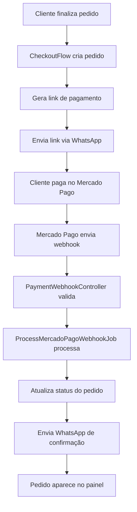

# Verificação do Fluxo de Pagamento - Mercado Pago

## Objetivo
Verificar se o fluxo completo de pagamento está funcionando corretamente, desde a geração do link de pagamento até a confirmação via webhook, envio de mensagem WhatsApp ao cliente e exibição no painel do lojista.

## Fluxo Atual Identificado



## Problemas Identificados

### 1. **BUG CRÍTICO: Inconsistência no código do pedido** ✅ **CORRIGIDO**
**Local**: `app/Services/Zapi/Flows/CheckoutFlow.php`
**Linhas**: 780 vs 810

**Problema**:
- Linha 780: `$orderCode = 'ZAP-'.date('ymd').'-'.strtoupper(Str::random(4));`
- Linha 810: `'code' => strtoupper(Str::random(6))`

**Impacto**: O código do pedido armazenado no banco de dados não corresponde ao código usado no link de pagamento e nas mensagens. O webhook não conseguirá encontrar o pedido pelo código.

**Solução Implementada**:
```php
// Gerar código uma vez (linha 780)
$orderCode = 'ZAP-' . date('ymd') . '-' . strtoupper(Str::random(4));
// Usar no create (linha 810 corrigida)
'code' => $orderCode,
```

**Alterações adicionais**:
- Adicionado `'order_code' => $orderCode` ao `raw_payload` para referência futura
- Corrigido bug de nome de classe em `ToggleOrderStatus.php` que impedia execução de testes
- **Adicionado `code_confirm` à mensagem WhatsApp**: Agora a mensagem de confirmação de pagamento inclui o código de confirmação que o cliente deve apresentar ao entregador

### 2. **Configuração do Webhook Secret**
**Local**: `config/services.php` (não verificado)
**Problema**: O método `validateWebhookSignature` em `MercadoPagoPaymentService` requer `config('services.mercadopago.webhook_secret')`.

**Impacto**: Webhooks podem ser rejeitados se o secret não estiver configurado.

**Solução**: Verificar se a configuração existe no `.env`:
```
MERCADO_PAGO_WEBHOOK_SECRET=seu_secret_aqui
```

### 3. **Painel do Lojista (AdminDashboardController)**
**Problema**: Mostra todos os pedidos para todos os administradores, sem filtro por loja.

**Impacto**: Lojistas podem ver pedidos de outras lojas.

**Solução**: Se for um painel por loja, adicionar filtro por `store_id` ou `company_id`.

## Componentes do Fluxo

### 1. Geração do Link de Pagamento
- **Arquivo**: `app/Services/Zapi/Flows/CheckoutFlow.php`
- **Método**: `processPayment()`
- **Funcionalidade**: Cria pedido, gera link de pagamento, envia via WhatsApp
- **Status**: ✅ Funcional (com bug no código do pedido)

### 2. Webhook do Mercado Pago
- **Arquivo**: `app/Http/Controllers/Api/PaymentWebhookController.php`
- **Rota**: `POST /api/webhooks/payment`
- **Funcionalidade**: Recebe webhooks, valida assinatura, despacha job
- **Status**: ✅ Funcional

### 3. Processamento do Webhook
- **Arquivo**: `app/Jobs/Payment/ProcessMercadoPagoWebhookJob.php`
- **Funcionalidade**: Processa pagamento, atualiza pedido, envia notificação
- **Status**: ✅ Funcional

### 4. Notificação WhatsApp
- **Método**: `sendPaymentApprovedNotification()` no job
- **Conteúdo**: Inclui "Seu pedido já está sendo preparado"
- **Status**: ✅ Funcional

### 5. Painel do Lojista
- **Arquivo**: `app/Http\Controllers\Web\AdminDashboardController.php`
- **Funcionalidade**: Exibe pedidos recentes e estatísticas
- **Status**: ✅ Funcional (mas sem filtro por loja)

## Testes Disponíveis

### Comando de Teste
```bash
php artisan webhook:test-mercadopago --order-code=ZAP-260504-ABCD --status=approved
```

**Opções**:
- `--order-code`: Código do pedido para testar
- `--payment-id`: ID do pagamento simulado
- `--status`: Status do pagamento (approved, pending, rejected)
- `--sync`: Processar sincronamente sem fila
- `--list`: Listar pedidos disponíveis para teste

## Ações Recomendadas

### Prioridade Alta
1. **Corrigir bug do código do pedido** em `CheckoutFlow.php`
2. **Verificar configuração** do webhook secret no `.env`

### Prioridade Média
3. **Testar fluxo completo** usando o comando de teste
4. **Verificar credenciais Z-API** para envio de WhatsApp

### Prioridade Baixa
5. **Melhorar painel do lojista** com filtros por loja
6. **Adicionar logs mais detalhados** para debugging

## Como Testar o Fluxo Completo

1. **Criar pedido de teste**:
   ```bash
   # Usar interface WhatsApp para gerar pedido real
   # Ou criar pedido manualmente no banco
   ```

2. **Testar webhook**:
   ```bash
   php artisan webhook:test-mercadopago --order-code=CODIGO_DO_PEDIDO --status=approved
   ```

3. **Verificar resultados**:
   - Pedido atualizado com `payment_status = 'paid'`
   - Mensagem WhatsApp enviada ao cliente
   - Pedido visível no painel admin (`/admin`)

4. **Monitorar logs**:
   ```bash
   tail -f storage/logs/laravel.log
   ```

## Configurações Necessárias

### Variáveis de Ambiente
```
MERCADO_PAGO_ACCESS_TOKEN=seu_access_token
MERCADO_PAGO_WEBHOOK_SECRET=seu_webhook_secret
ZAPI_INSTANCE_ID=instance_id
ZAPI_INSTANCE_TOKEN=instance_token
ZAPI_CLIENT_TOKEN=client_token
```

### Configuração do Webhook no Mercado Pago
- URL: `https://seu-dominio.com/api/webhooks/payment`
- Eventos: `payment.updated`, `payment.created`

## Conclusão

O fluxo básico está implementado e funcional, mas com um bug crítico que impede o correto processamento dos webhooks. Após corrigir o bug do código do pedido, o fluxo deve funcionar completamente.

**Próximos passos**: Corrigir o bug e testar o fluxo end-to-end.